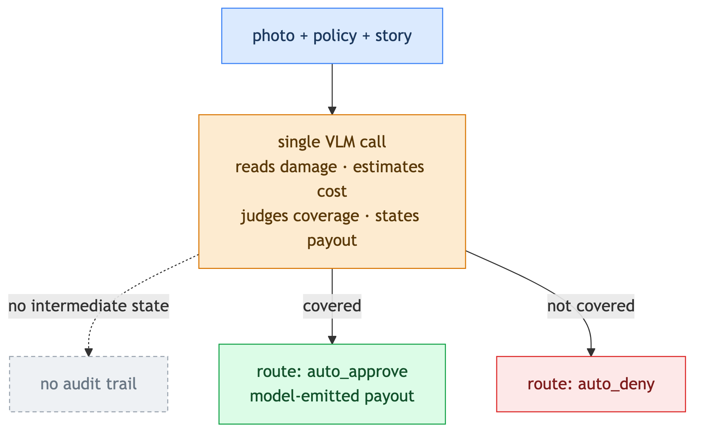
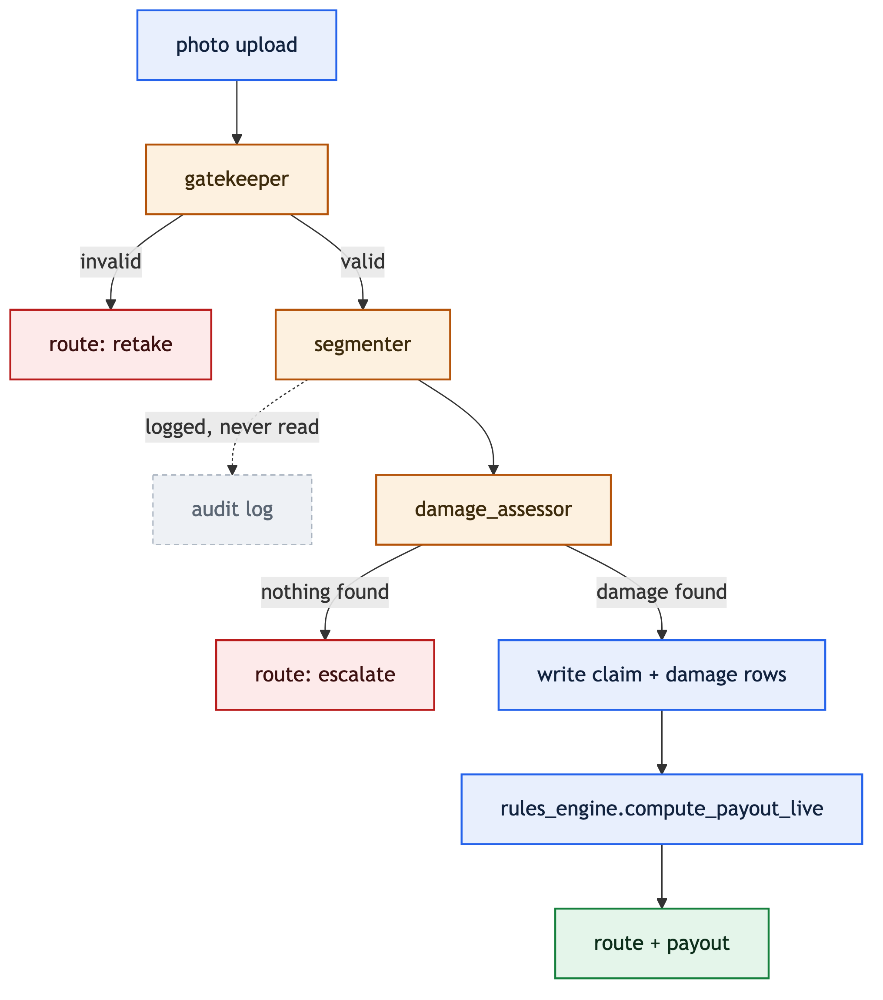
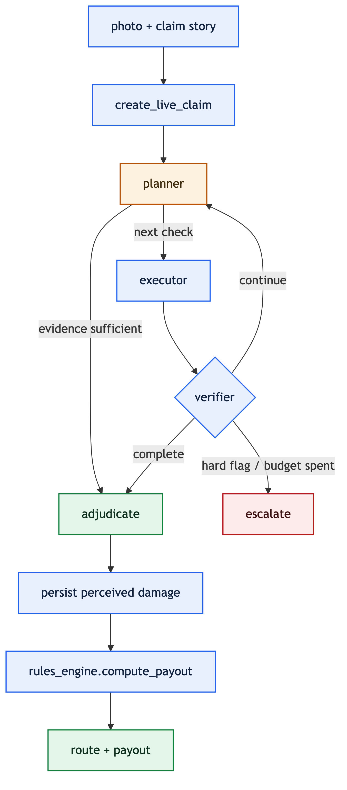

# Avahi — Photo-to-Coverage Car Insurance Claims

Photo of vehicle damage + policy + claim story → route (`auto_approve` / `auto_deny` / `escalate`) + payout.
The same problem, built **three ways** and scored against one shared, frozen golden dataset.

**Tech stack:** Python · FastAPI + Uvicorn · SQLite · Groq VLM (`qwen/qwen3.6-27b`) · LangGraph (Arch 3) · LangSmith tracing · Pydantic · Pillow · pytest

## Architecture 1 — Monolith

One VLM call decides the whole claim: reads damage, prices repair, judges coverage, states the payout. No rules engine, no intermediate state — the baseline the comparison argues against.

## Architecture 2 — Split Pipeline

A plain linear pipeline: `gatekeeper → segmenter → damage_assessor → rules_engine`. Vision only rejects bad photos and supplies confidence; the payout is computed deterministically from DB-stored damage.

## Architecture 3 — Bounded PEV Agent

A bounded Planner → Executor → Verifier agent (LangGraph, ≤8 tool calls, ≤2 replans). It produces an evidence package; a separate deterministic `adjudicate` node runs the same rules engine — the money stays outside the loop.

