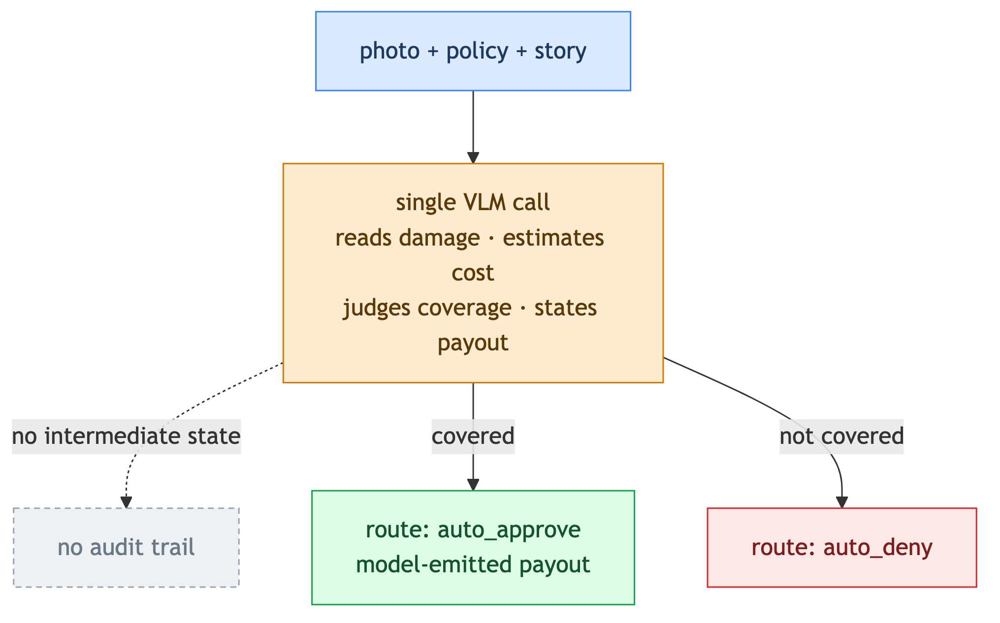
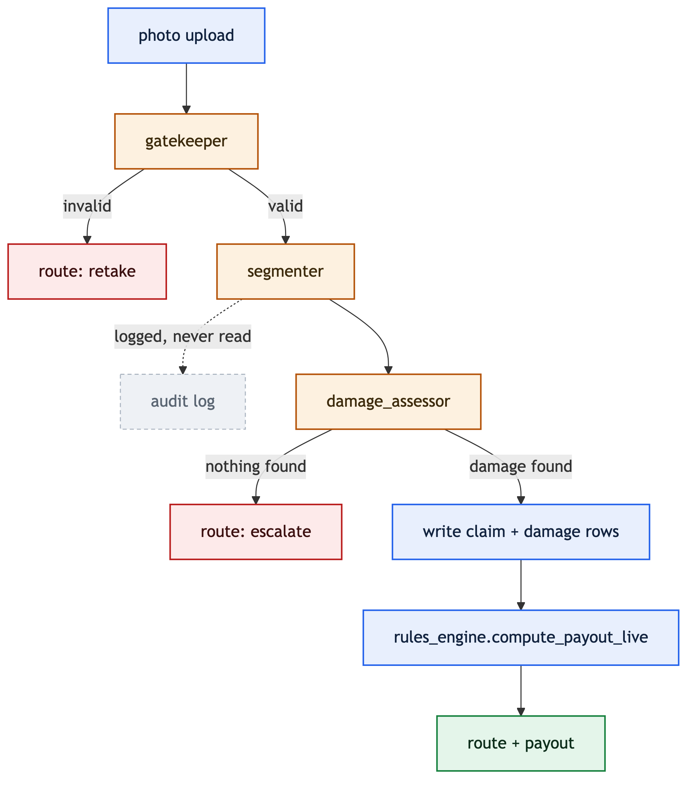
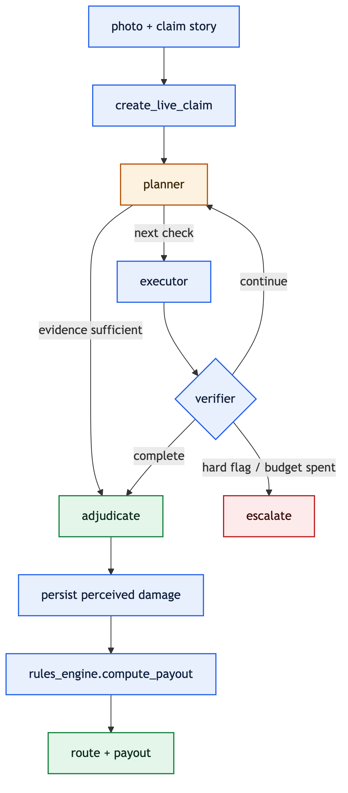

# Avahi — Photo-to-Coverage Car Insurance Claims

Photo of vehicle damage + policy + claim story → route (`auto_approve` / `auto_deny` / `escalate`) + payout.
The same problem, built **three ways** and scored against one shared, frozen golden dataset.

**Tech stack:** Python · FastAPI + Uvicorn · SQLite · Groq VLM (`qwen/qwen3.6-27b`) · LangGraph (Arch 3) · LangSmith tracing · Pydantic · Pillow · pytest

## Architecture 1 — Monolith

One VLM call decides the whole claim: reads damage, prices repair, judges coverage, states the payout. No rules engine, no intermediate state — the baseline the comparison argues against.

## Architecture 2 — Split Pipeline

A plain linear pipeline: `gatekeeper → segmenter → damage_assessor → rules_engine`. Vision only rejects bad photos and supplies confidence; the payout is computed deterministically from DB-stored damage.

## Architecture 3 — Bounded PEV Agent

A bounded Planner → Executor → Verifier agent (LangGraph, ≤8 tool calls, ≤2 replans). It produces an evidence package; a separate deterministic `adjudicate` node runs the same rules engine — the money stays outside the loop.

## Observability — LangSmith tracing

An agent that picks its own next step is only auditable if you can replay what it picked and why, so Arch 3 is instrumented for LangSmith. Tracing is opt-in via env config and scoped to Arch 3 — Arch 1 and Arch 2 stay on plain self-hosted logs.

What a trace shows per claim:

- **The whole PEV loop** — LangGraph auto-traces every `plan → execute → verify` hop, so you see the actual investigation path taken, the replans, and where a bound was hit.
- **One named run per claim** — each run is labelled with its claim id plus `arch3` / `pev` tags (`arch3_agent/agent.py`), so a single claim is findable instead of buried in anonymous graph runs.
- **Tool spans** — the investigation checks in `arch3_agent/tools.py` (`gatekeep`, `segment`, `assess_damage`, `match_damage_to_story`, `interpret_peril`) each trace as their own span.
- **LLM spans with token usage** — `arch3_agent/llm.py` attaches the model and usage from the Groq response, so a claim's token cost sits next to its decision.
